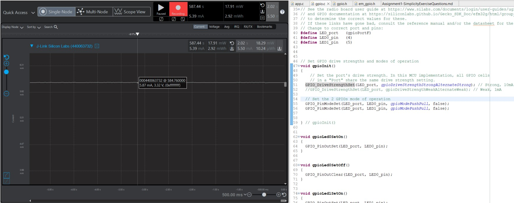
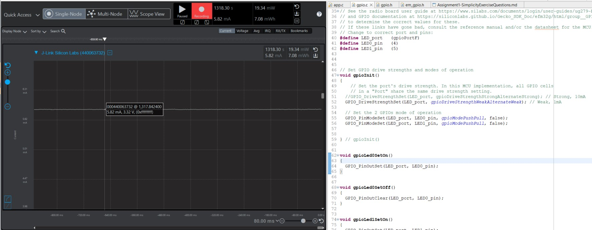
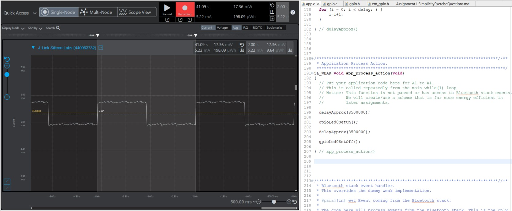
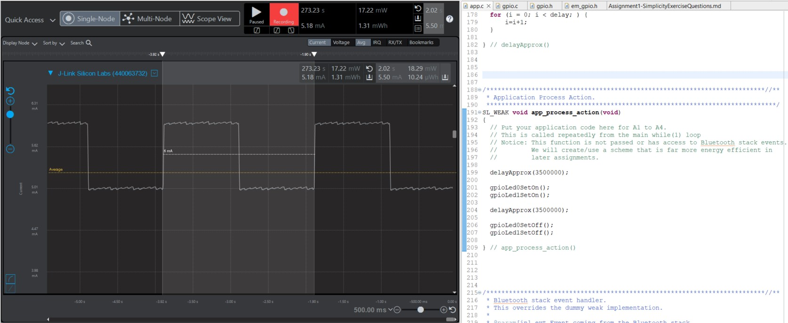

Note: For all assignments and Energy Profiler measurements you’ll be taking this semester,  Peak measurements are instantaneous measurements taken at a specific point in time. In the Energy Profiler, this is accomplished by left-clicking at a location along the time axis.
Average measurements are measurements that are taken over a time-span. In the Energy Profiler, this is accomplished by left-clicking and dragging a region along the time axis.

Please include your answers to the questions below with your submission, entering into the space below each question
See [Mastering Markdown](https://guides.github.com/features/mastering-markdown/) for github markdown formatting if desired.

**1. How much current does the system draw (instantaneous measurement) when a single LED is on with the GPIO pin set to StrongAlternateStrong?**
   Answer: The system was observed to be drawing 5.87 mA current when only LED0 was active, with its GPIO pin configured as StrongAlternateStrong. The code was modified to enable this configuration.
   

**2. How much current does the system draw (instantaneous measurement) when a single LED is on with the GPIO pin set to WeakAlternateWeak?**
   Answer: The system was observed to be drawing 5.82 mA current when only LED0 was active, with its GPIO pin configured as WeakAlternateWeak. The code was modified to enable this configuration.
   

**3. Is there a meaningful difference in current between the answers for question 1 and 2? Please explain your answer, referencing the main board schematic, WSTK-Main-BRD4001A-A01-schematic.pdf or WSTK-Main-BRD4002A-A06-schematic.pdf, and AEM Accuracy in the ug279-brd4104a-user-guide.pdf. Both of these PDF files are available in the ECEN 5823 Student Public Folder in Google drive at: https://drive.google.com/drive/folders/1ACI8sUKakgpOLzwsGZkns3CQtc7r35bB?usp=sharing . Extra credit is available for this question and depends on your answer.**
   Answer: According to 'ug279-brd4104a-user-guide.pdf', the AEM is accurate within 0.1mA for currents above 250uA. Which means, 0.05mA difference in current between the answers for question 1 and 2 is not meaningful. There can be two factors related to this behavior:
   * The static current calculation based on 'WSTK-Main-BRD4001A-A01-schematic.pdf': I = (V(supply)-V(LED))/R(107/8) = (3.3-1.8)/3000 = 0.5 mA. This value is less than the maximum drive strength of WeakAlternateWeak configuration. So, it does not affect the LED consumption value.
   * The actual difference will be the slew rate or the rise time of the signal, not the current value.

**4. With the WeakAlternateWeak drive strength setting, what is the average current for 1 complete on-off cycle for 1 LED with an on-off duty cycle of 50% (approximately 1 sec on, 1 sec off)?**
   Answer: The system was observed to be drawing 5.22 mA current on average for 1 complete on-off cycle for LED0 with an on-off duty cycle of 50%. The drive strength was set to WeakAlternateWeak.
   

**5. With the WeakAlternateWeak drive strength setting, what is the average current for 1 complete on-off cycle for 2 LEDs (both on at the time same and both off at the same time) with an on-off duty cycle of 50% (approximately 1 sec on, 1 sec off)?**
   Answer: The system was observed to be drawing 5.50 mA current on average for 1 complete on-off cycle for both the LEDs with an on-off duty cycle of 50%. The drive strength was set to WeakAlternateWeak.
   